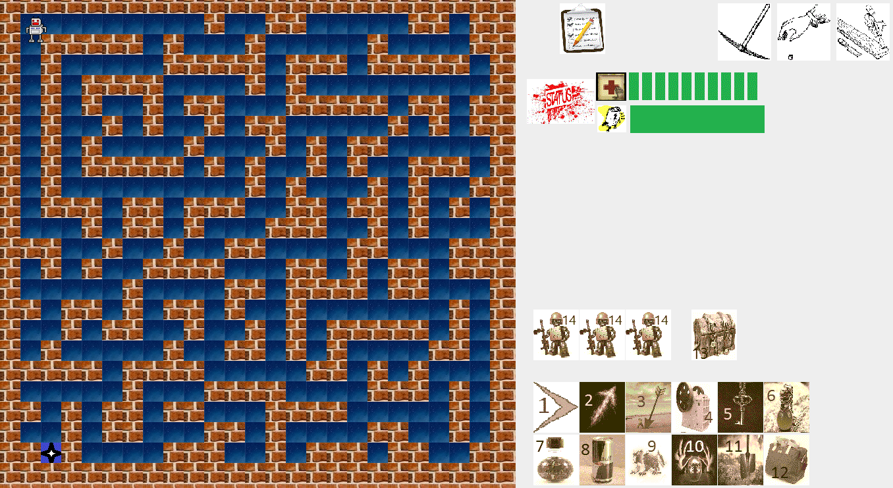

# Maze Game with 2D Graphics

    This is a Maze game with 2D Graphics written in Java.

## Description

    A maze game with several features that make it more challenging for a player to solve. The player can walk through the maze by pressing arrow keys, and the goal is to get from the starting tile to the ending tile. However, it's not that easy! as the tiles might have enemies which cause damages to the player. Some features:
    <ul>
        <li> 
            Each tile might have several items which can be picked up and added to the inventory for later use.
        </li>
        <li> 
            The items enable the player to do different things such as killing enemies, or getting some energy points.
        </li>
        <li>
             The player can see a list of all picked up items and their counts by clicking on the inventory icon.
        </li>
        <li> 
             The player is able to destroy all surrounding walls of a tile if the stone breaker (item 4) is available in the inventory.
        </li>
        <li> 
            Tiles might have locked chests which contain different items. The player needs to have a key (e.g., by picking up the key from other tiles) to unlock a chest.
        </li>
    </ul>

Have fun!

